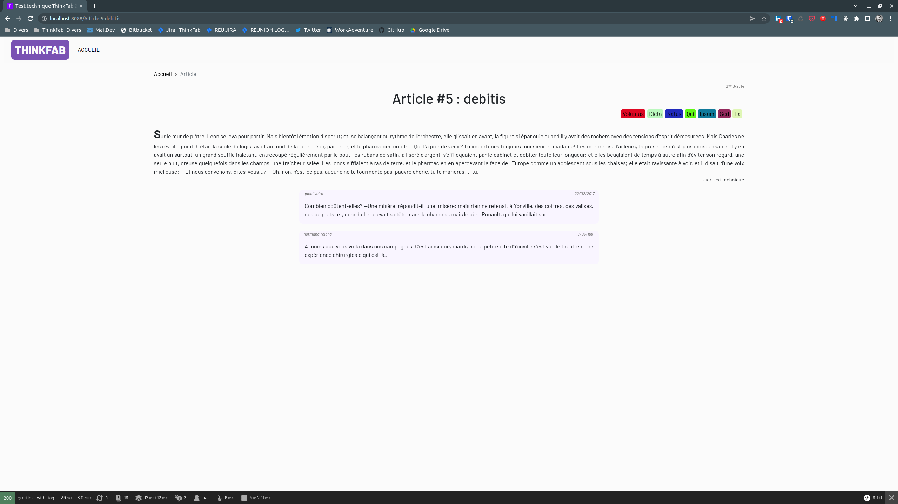
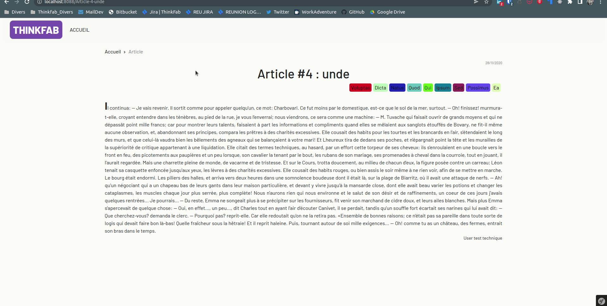

# Test technique Thinkfab

## Avant propos
### Bonjour!
Ce que tu t'apprêtes à réaliser est un test technique, il n'y a pas de mauvaises réponses, nous souhaitons comprendre
comment tu travailles et quelle est ta réflexion d'un point de vue implémentation de feature.

Le code produit dans ce repository n'est pas parfait, loin de là.
Nous ferons une réunion afin d'échanger sur le code réalisé. Si tu n'arrives pas au bout de l'exercice, ce n'est pas grave.
Par contre, je te demanderai de poser des questions lors de l'entretien que nous aurons concernant ce que tu n'as pas compris.

**<span style="color: red;">Pour réaliser ce test technique, tu dois au préalable avoir installé Docker et Docker-compose sur ta machine.</span>**

**<span style="color: cyan;">Si tu utilises Windows ou mac il faudra php:8.1 - Yarn - Mysql - Composer - Symfony cli d'installé sur ta machine</span>**

----

## Installation
### Docker :
Pour installer le projet, tu dois exécuter la commande `make install` à la racine du dossier. Tu auras le temps de faire couler un café ! *(Nous aimons bien le café)*

### Windows/MAC
Il faudra que tu lances les commandes suivantes pour faire tourner le projet sur ton poste:
```shell
php -d memory_limit=4G bin/composer install     // installation des bundles externes
bin/console d:d:create                          // creation de la bdd
bin/console d:m:migrate                         // execution des migrations
bin/console d:f:l --append                      // execution des fixtures
yarn install                                    // installation des dependance yarn
yarn encore dev                                 // build des fichiers 
symfony server:start                            // lancement du server symfony
```
Si tu rencontres un souci au moment de l'installation, consulte [les erreurs communes](#erreurs-communes-lors-de-linstallation) fais moi en pars tout de suite, soit par mail ps@thinkfab.fr, soit via [linkedin](https://www.linkedin.com/in/paul-strentz/) *(je suis plus reactif sur LinkedIn)*

Pour réaliser ce test tu devras créer une nouvelle branche en partant de main. La branche devra se nommer en suivant ce pattern:
NOM_Prénom. 

Tu devras réaliser un commit par objectif en suivant ce pattern exemple: "feature: decription de la feature -- Objectif 1"

Tu devras pusher ton travail et m'en informer, soit par mail ps@thinkfab.fr, soit via [linkedin](https://www.linkedin.com/in/paul-strentz/)

## Comment fonctionne le projet
Ce projet utilise EasyAdmin 4 la route d'accès au login de connexion est [http://localhost:8088/login/login-admin-interface](http://localhost:8088/login/login-admin-interface)

### Pour se connecter:
- <u>Mail</u> : test@technique.com
- <u>Password</u> : p@ssword

Pour le reste de l'application, son fonctionnement est relativement simple à comprendre.
Tu n'auras pas besoin de te connecter en tant qu'admin pour la réalisation de ce test technique.
Hormis pour te générer de nouvelles données.

## <u>Objectif 1</u> *(obligatoire)*
Le but de ce test est d'afficher les commentaires dans les pages d'articles. Il faudra utiliser [Symfony UX Twig Components](https://symfony.com/bundles/ux-twig-component/current/index.html).

Si un article n'a pas de commentaire, tu n'as pas besoin d'afficher quelque chose.

l'attendu :



## <u>Objectif 2</u> *(obligatoire)*
Tu devras changer l'animation des pages actuellement elles sont animés pour un affichage de slide vers le bas. l'attendu est un affichage de la page en fade-in fade-out.

l'attendu :


## <u>Objectif 3</u> *(optionnel)*
Lors de ce troisième objectif, je souhaite pouvoir bénéficier de la fonctionnalité d'ajout d'un commentaire à un article.
Le nom de l'utilisateur est obligatoire et la date de création doit être générée automatiquement. Un petit plus serait de pouvoir utiliser un champ de texte CKEditor.

*Pour cette troisième partie il n'y a pas d'attendu d'un point de vue design en particulier. Mais il faut que ca s'integre bien dans le site.*


### Erreurs communes lors de l'installation
><span style="background-color:#f55f69; color:black;">Could not create database test-technique for connection named default</span></br>
 <span style="background-color:#f55f69; color:black;">An exception occurred while executing a query: SQLSTATE[HY000]: General error: 1007 Can't create database 'test-technique'; database exists</span>

il faudra lancer alors la commande `make db-drop` puis de relancer la commande `make install`
